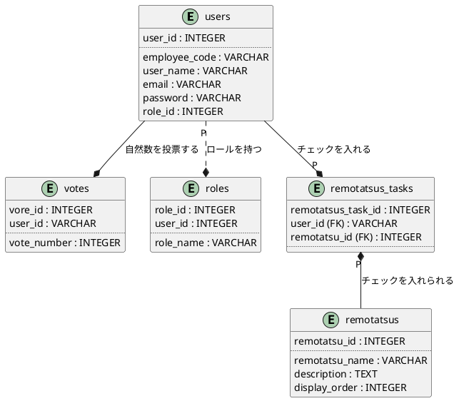
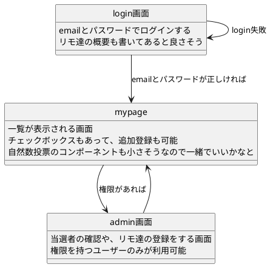

# DataBase 設計書

```plantuml
@startuml
entity "users" as user_table {
  user_id : INTEGER
  ..
  employee_code : VARCHAR
  user_name : VARCHAR
  email : VARCHAR
  password : VARCHAR
  role_id : INTEGER
}

entity "votes" as vote_table {
  vore_id : INTEGER
  user_id : VARCHAR
  ..
  vote_number : INTEGER
}

entity "roles" as role_table {
  role_id : INTEGER
  user_id : INTEGER
  ..
  role_name : VARCHAR
}

entity "remotatsus" as remotatsu_table{
  remotatsu_id : INTEGER
  ..
  remotatsu_name : VARCHAR
  description : TEXT
  display_order : INTEGER
}

entity "remotatsus_tasks" as check_table{
  remotatsus_task_id : INTEGER
  user_id (FK) : VARCHAR
  remotatsu_id (FK) : INTEGER
  ..
}

user_table --* "P" check_table : チェックを入れる
check_table  "P" *-- remotatsu_table : チェックを入れられる
user_table "P" ..* role_table : ロールを持つ
user_table --* vote_table : 自然数を投票する


@enduml
```

# 画面フロー

```plantuml
@startuml

hide circle

entity "login画面" as login_page {
  emailとパスワードでログインする
  リモ達の概要も書いてあると良さそう
}

entity "mypage" as mypage{
  一覧が表示される画面
  チェックボックスもあって、追加登録も可能
  自然数投票のコンポーネントも小さそうなので一緒でいいかなと
}

entity "admin画面" as admin_page {
  当選者の確認や、リモ達の登録をする画面
  権限を持つユーザーのみが利用可能
}

login_page --> login_page : login失敗
login_page --> mypage : emailとパスワードが正しければ
mypage --> admin_page : 権限があれば
admin_page --> mypage

@enduml
```

